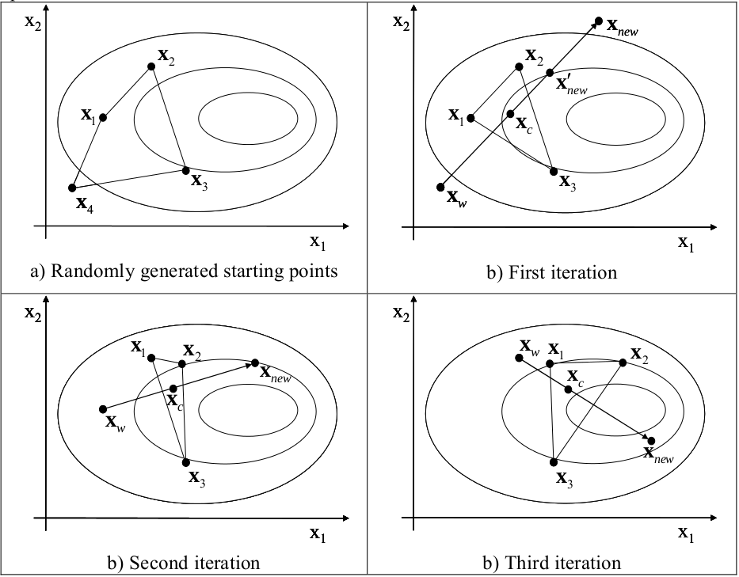

Complex Method -- Description
===========

The Complex method was first presented by Box [1], and later improved by Guin [2]. 
The method is a constraint simplex method, hence the name Complex, developed from the Simplex method by Spendley et al [3] and Nelder Mead, [4]. Similar related methods go under names such as Nelder-Mead Simplex. The main difference between the Simplex method and the complex method is that the Complex method uses more points during the search process.

The Complex Method
******************

In the Complex method, the word complex refers to a geometric shape with :math:`k \geq n+1`
, points in an n-dimensional space. 
These k points are known as vertices of the complex. 
To make the explanation of the algorithm simple we wiill focus on a two-dimensional space and a complex consisting of four vertices, i.e. n = 2 and  k = 4.

Typically the number of points in the complex (k), is twice as many as the number of design variables (n). 
The starting points are generated using random numbers. Each of the k points in the complex could be expressed according to [5] where :math:`x^l` and :math:`x^u` are the upper and lower variable limits and  :math:`R` a random number in the interval [0, 1].

.. math::  x_{i} = x_{j}^l  + R ( x_{j}^u -  x_{j}^l) \;\; \;  i&=1,2 \ldots k\\j & =1,2 \ldots n
   :label: one

The objective is to minimize an objective function  :math:`f(x)`. The main idea of the algorithm is to replace the worst point by a new point obtained
by reflecting the worst point through the centroid of the remaining points in the complex,
as illustrated in Figure 1. The worst point corresponds to the maximum value of the function vector 
:math:`f(x)`. The centroid, :math:`x_c`, of the points in the complex excluding the worst point :math:`x_w`, could be
calculated according to:

.. math::  x_{c,j} = \frac{1}{k-1} \left[ \left(\sum_{i=1}^k x_{i,j}\right) - x_{w,j}\right] \;\; i = 1,2 \ldots n
   :label: two

The new point is now calculated as the reflection of the worst point through the centroid
by a factor :math:`\alpha`

.. math:: x_{new} = x_{c} +  \alpha  (x_{c}-x_{w})
   :label: three

The reflection coefficient :math:`\alpha` should equal 1.3 according to Box. If the new point is better
than the worst,  :math:`x_w` is replaced by :math:`x_{new}` and the procedure starts over by reflecting the point
that is worst in the new complex.
If the new point is still the worst it is moved halfway towards the centroid according
to:

.. math:: x_{new}^{'} = x_{c} +  \frac{\alpha}{2}(x_{c}-x_{w})
   :label: four

This Equation :eq:`four` ould be rearranged by substituting :math:`\alpha * (x_{c}-x_{w}) =  x_{new} - x_{c}` from equation (45) yielding

.. math:: x_{new}^{'} = \frac{1}{2}(x_{c} + x_{new})
   :label: five

The procedure of moving the worst point towards the centroid is repeated until the new
points stop repeating as the worst.

    **Figure 1 :Working principle of the Complex method for a problem with 2 design variables and 4 vertices in the complex.
    The curves represent contour lines of the objective function with the optimum to the right.**

The procedure outlined is carried out until the complex has converged or until a predescribed number of evaluations is reached. Convergence could be measured either in the
function space or in variable space. In the function space the complex is considered
converged if the difference between the maximum and minimum function values of all
the points in the complex is less then a predescribed measure :math:`\epsilon_f`.
Likewise, the complex has converged in the variable space if the maximum difference in all dimensions is less that a certain value :math:`\epsilon_v`, Thus :math:`\epsilon_f` and :math:`\epsilon_v` constitutes a measure of the spread of the complex in function space and parameter space respectively.

.. math:: {max}( f ( x_{i}) ) -  {min}( f ( x_{i}) )   \leq  {\epsilon}_f  \;\;\; i= 1,2 \ldots k 
   :label: six

.. math:: {max[} {max}( x_{i,j} ) -  {min}(x_{i,j} ) { ]}  \leq  {\epsilon}_v  \;\;\; i= 1,2 \ldots k \\ j= 1,2 \ldots n 
   :label: seven

As has been stated earlier, the complex is designed to handle constraints. Constraints
in the form of limits on the design variables is handle by checking if the new point is
within the variable limits. If not it is move to the feasible side of the limit. If the new
points is violating any other constraint it is moved halfway towards the centroid.

Pseudo Code
***********

The working principle of the complex method is here outlined using pseudo code.

Pseudo Code ::
 
	| Generate Starting points
	| Calculate objective function
	| Evaluate constraints
	| Identify the worst point
	| While stop criteria is not met
	|	Calculate centroid
	|	Reflect worst point through centroid
	|	Make sure the new point is within the variable limits
	|	Calculate objective function for the new point
	|	Evaluate constraints
	|	Identify the worst point
	|	While the new point is the worst or a constraint is violated
	|		Move the new point towards the centroid
	|		Calculate the objective function
	|		Evaluate constraints
	|	end while
	|	Identify the worst point in the new complex
	|	Check stop criteria
	| end while
	| Output the optimal point

The Complex-RF Method
*********************

The pseudo code above describes the original Complex method as it was presented by
Box. The method has some weaknesses. For one thing, if a local minimum is located at
the centroid the method will keep on moving new points towards the centroid where the
whole complex will collapse in one point [2]. In order to avoid this, the new point could gradually be moved towards the best point. Based
on the equation :eq:`five` ,   the new point could now be expressed as

.. math:: x_{new}^{'} =  (( (1-a) x_{c} + a x_{min} )  + x_{new})\frac{1}{2}
   :label: eight 

where  :math:`x_{min}` is the best point and

.. math:: a = 1-e^{-k_f \frac{1}{b}  }
   :label: nine

where  :math:`k_r` is the number of times the point has repeated as the worst and b is a constant that
here equals to 4. Thus the more times the point repeats as the worst the smaller a gets and
the new points is moved towards the best point since x min will have a large importance in
the calculation of  :math:`x_{new}^{'}`.
Another feature that could be added in order to make the method less prone to
collapse and lose dimensionality and to avoid getting stuck in local minima is to add
some randomness to it. This is accomplished by introducing a random noise vector r to
the new point in accordance to equation eq:`ten` 

.. math:: x_{new}^{'} = \left( (1-a)  x_{min} + a x_{c} + x_{new}\right) \frac{1}{2} + r
   :label: ten

The random noise is calculated according to

.. math:: r_f = r_{fac} * max\left( { \frac{ \triangle {x_{i}}} {{x_i}^u - {x_i}^l} }\right)  \left( {x_i}^u - {x_i}^l \right) \left(R-0.5\right)
   :label: eleven

where  :math:`r_{fac}` is a randomization factor, :math:`x^{l}` and  :math:`x^{u}` the variable limits and :math:`\triangle{x_{i}}` represent the
spread in the i:th variable of the complex, and :math:`R` is a random variable in the interval
[0.1]. This formulation implies that the noise added is a function of the convergence  :math:`(\triangle{x_{i}})`, and the shape of the original design space, i.e. the variable limits. 
Furthermore, the formulation makes it possible for the complex to maintain diversity and also regain lost
dimensionality. Since the noise is a function of the maximum spread, perturbations could
be added to dimensions in which the complex has already converged. This facilitates
avoidance of local optima. The randomization factor thus makes the method more robust
in finding the global optima to the cost of somewhat slower convergence. Experiments
have shown that a randomization factor of 0.3 is a good compromise between
convergence speed and performance.

It is also possible to include a forgetting factor, :math:`\gamma`, which ensures that the Complex is
made up predominantly with recent points. This is necessary if the objective function
varies over time. In that case, old objective function values become increasingly
unreliable and should be replaced by new ones. This is particularly true if the
optimization is to be used to optimize parameters in a real process. In this case there may
be drift in the parameters of the physical system. Introducing a forgetting factor has also
been found to improve the success rate in other situations as well. One such situation is if
the objective function is noisy, i.e. there are local variations in the objective function
between points close to each other in parameter space, or if the objective function has a
discrete nature with flat plateaus. The basic principal of the forgetting factor is to
continuously deteriorate objective function values The underlying mathematics of the
forgetting factor is described in detail in [6].
In [6] all parameters of the Complex algorithm are optimized in order to find the
parameter set that gives the best possible performance of the algorithm. It is then
concluded that 
:math:`\alpha = 1.5`, 
:math:`r_{fac} = 0.3` and
:math:`\gamma = 0.3` give a good performance of the algorithm.
The complex method has been applied to a wide range of problems such as physics
, structural engineering, fluid power system design and aerospace
engineering.

.. include:: ../source/References.rst
